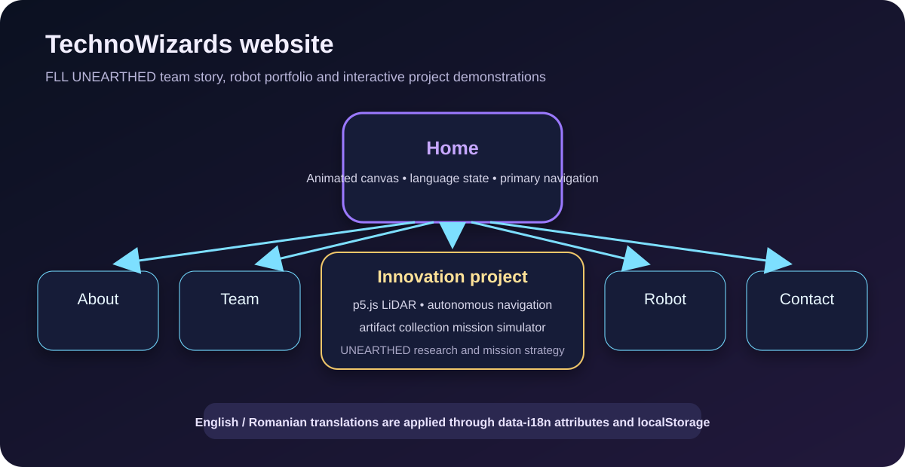
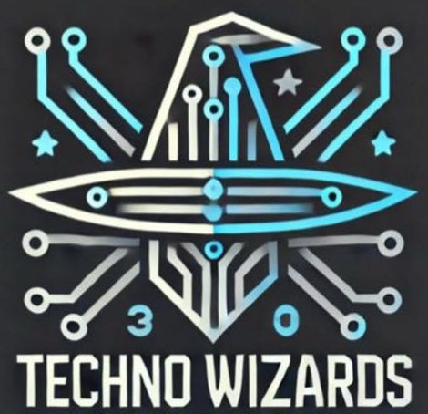
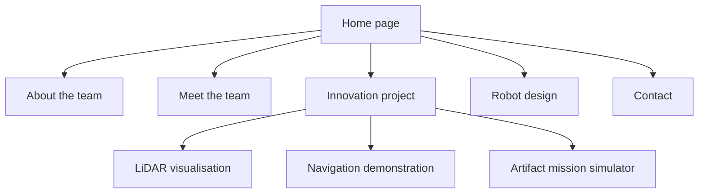

# TechnoWizards

**The bilingual team website and interactive project showcase for an eight-member FIRST LEGO League team from Paradis College.**

<p align="center">
  
</p>

<p align="center">
  
</p>

<p align="center">
  
  
  
  
  
  
</p>

## Project purpose

This repository presents the TechnoWizards team, its LEGO SPIKE Prime robot and its work for the FIRST LEGO League **UNEARTHED™ 2025–26** season. It combines a conventional team website with browser-based demonstrations of robotics concepts used in the innovation-project story.

The website covers:

- the team mission and history;
- members and roles;
- the SPIKE Prime robot and its attachments;
- the archaeology-themed innovation project;
- interactive LiDAR, navigation and artifact-collection demonstrations;
- contact and collaboration information;
- English and Romanian content.

This is a static browser application. It has no backend, database, package manager or build step.

## Website pages

| Page | File | Purpose |
|---|---|---|
| Home | `index.html` | Animated landing page and main navigation |
| About | `about.html` | Team mission, history, competition elements and core values |
| Team | `team.html` | Team-member presentation |
| Project | `project.html` | Innovation project, interactive simulations and mission strategy |
| Robot | `robot.html` | SPIKE Prime platform, capabilities and attachments |
| Contact | `contact.html` | Contact methods and collaboration workflow |

## Interactive demonstrations

The innovation-project page loads p5.js and three separate simulations:

### LiDAR scanning

`assets/js/lidar.js` visualises a rotating distance sensor and its rays. It helps explain how a robot can map nearby obstacles in low-visibility archaeological environments.

### Autonomous navigation

`assets/js/navigation.js` demonstrates a robot moving through an obstacle field. It presents the idea of combining sensor measurements with path planning.

### Artifact mission

`assets/js/challenge.js` creates an archaeology-themed field with:

- a home zone;
- a museum zone;
- randomly positioned artifacts;
- a robot with position, target, heading and carrying state;
- autonomous collection and scoring behaviour;
- a reset action that generates a new layout.

These are explanatory animations, not simulations of the physical SPIKE Prime control code.

## User journey



## Internationalisation

The site uses a lightweight custom translation system in:

```text
assets/js/language.js
```

The module:

1. reads the selected language from `localStorage`;
2. defaults to English;
3. stores English and Romanian translation dictionaries;
4. finds elements with `data-i18n` attributes;
5. replaces their text with the selected language;
6. keeps the choice across page navigation and browser sessions.

Example markup:

```html
<h1 data-i18n="ourRobot">Our FLL SPIKE Prime Robot</h1>
```

When adding a key, update both language dictionaries. Missing translations should not be silently left in one language.

## Repository structure

```text
TechnoWizards/
├── index.html
├── about.html
├── team.html
├── project.html
├── robot.html
├── contact.html
├── assets/
│   ├── css/
│   │   ├── style.css
│   │   ├── animations.css
│   │   ├── project.css
│   │   └── robot.css
│   ├── images/
│   │   ├── logo.png
│   │   ├── robot-spike.jpg
│   │   └── ...
│   └── js/
│       ├── language.js
│       ├── landing.js
│       ├── lidar.js
│       ├── navigation.js
│       ├── challenge.js
│       └── robot.js
├── docs/
│   └── site-map.svg
└── README.md
```

## Run locally

### Python HTTP server

```bash
git clone https://github.com/paradis-college/TechnoWizards.git
cd TechnoWizards
python -m http.server 8000
```

Open:

```text
http://localhost:8000
```

### Node-based static server

```bash
npx serve .
```

### Visual Studio Code

Open the repository and launch `index.html` with the Live Server extension.

A local HTTP server is preferred to opening the file directly because it gives more realistic asset loading and navigation behaviour.

## Deploy

The repository can be hosted directly on GitHub Pages, Netlify, Vercel static hosting or any standard web server.

### GitHub Pages

1. Open repository **Settings**.
2. Select **Pages**.
3. Choose **Deploy from a branch**.
4. Select `main` and `/ (root)`.
5. Save.

No build command is required.

## External browser dependencies

The site currently retrieves:

- Google Fonts for Orbitron;
- p5.js 1.9.0 from jsDelivr on the project page.

A visitor therefore needs internet access for the intended typography and interactive p5.js demonstrations unless these assets are vendored locally.

## Add a page

1. Copy the navigation structure from an existing page.
2. Add the new link to every page’s navigation.
3. Create page-specific CSS only where shared styles are insufficient.
4. Add every visible string to both translation dictionaries.
5. Use `data-i18n` on translatable elements.
6. Test mobile navigation and both languages.
7. Update this README’s page table and site map.

## Add a simulation

1. Create a JavaScript file under `assets/js/`.
2. Use p5 instance mode so global functions do not collide with other simulations.
3. Create a unique container in `project.html`.
4. Attach the canvas to that container.
5. Keep the animation explanatory and label what is simplified.
6. Add reduced-motion or pause controls where continuous motion is used.
7. Test the simulation on narrow screens and low-powered devices.

## Suggested validation checklist

Before merging a change:

```text
[ ] Every navigation link works from every page
[ ] Every referenced image loads with case-sensitive paths
[ ] Browser console contains no errors
[ ] English and Romanian text both render
[ ] Language choice persists after navigation
[ ] p5.js canvases fit their containers
[ ] Keyboard users can reach links and controls
[ ] Focus states remain visible
[ ] Content works at mobile width
[ ] Animations respect reduced-motion preferences
```

## Accessibility notes

The site is visually rich, so accessibility must be checked deliberately:

- provide descriptive `alt` text for meaningful images;
- preserve heading hierarchy;
- ensure navigation has a clear keyboard focus state;
- use buttons for interactive controls rather than generic elements;
- avoid conveying status only through colour;
- verify contrast over animated backgrounds;
- add `prefers-reduced-motion` handling to canvas and CSS animation;
- provide text explanations next to demonstrations;
- ensure Romanian diacritics are encoded and displayed correctly.

## Known limitations

- Navigation markup is duplicated across pages.
- Translation data and language application logic live in one large JavaScript file.
- Some scripts are included more than once on individual pages.
- Static HTML requires manual updates to keep navigation consistent.
- p5.js and the font are loaded from third-party CDNs.
- There is no automated HTML, link, accessibility or visual-regression testing.
- Interactive demonstrations do not represent physical robot firmware or measured sensor data.
- Mission artifacts are randomised, so demonstrations are not deterministic.
- The robot page contains malformed list markup around the custom-attachment section.
- Team claims, competition milestones and schedules can become stale without a content-review process.
- There is no central metadata source for members, achievements or sponsors.
- There is no explicit top-level licence.

## Recommended improvements

1. Extract the shared navigation and footer into a reusable static-site template or component system.
2. Split translation dictionaries by page or generate them from structured JSON.
3. Add a visible language switch on every page and test missing-key behaviour.
4. Fix invalid HTML and run an HTML validator in CI.
5. Vendor or pin external visual dependencies where offline reliability matters.
6. Add pause/reset controls to every simulation.
7. Add screenshots or recordings of the real robot and competition field.
8. Distinguish measured robot capabilities from conceptual website animations.
9. Add Lighthouse and accessibility checks through GitHub Actions.
10. Add Open Graph metadata, favicon variants and a social preview image.
11. Introduce structured data for team members, awards and project milestones.
12. Document the real SPIKE Prime program in a separate robot-code repository when publishable.

## Project context

The repository’s strongest role is communication: it turns a robotics season into a public story that combines team identity, engineering explanation and interactive educational demonstrations. It is not the robot-control repository itself.

## Licence

No explicit licence is currently included. Unless one is added, the code, text and media remain under the copyright holders’ default rights.
